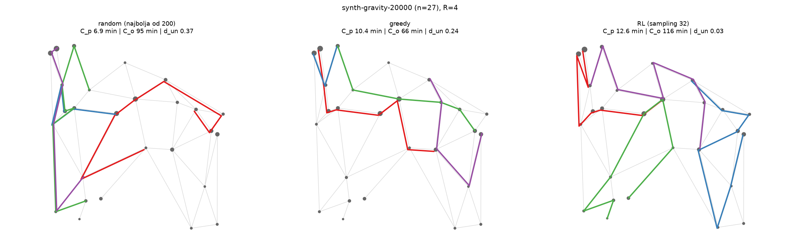

# Dizajn mreže linija javnog prevoza pomoću GNN + RL

Transit Network Design Problem (TNDP): dat je graf grada sa uličnom mrežom i matricom
tražnje putovanja, traži se skup autobuskih linija koji dobro opslužuje putnike uz
razuman trošak operatera. Problem je NP-težak i klasično se rešava metaheuristikama po
gradu; ovde umesto toga graf neuronska mreža uči **heuristiku** na hiljadama sintetičkih
gradova, pa je primenjuje na nov grad u jednom prolazu, bez ponovne optimizacije.



Seminarski rad za predmet Eksperimenti sa neuronskim mrežama 2 (DMI, UNSPMF), po uzoru
na Holliday et al. (Transportmetrica B, 2025). Mreža je GATv2 sa pointer mehanizmom,
trenirana REINFORCE-om; poređenje je sa random i greedy baselinima na benchmark
instancama iz literature (Mandl, Mumford) i na held-out sintetici.

```
 ┌──────────────────────┐        ┌────────────────────────┐
 │ sintetički generator │        │  benchmark instance    │
 │ Delaunay + gravity   │        │  Mandl, Mumford (CSV)  │
 └──────────┬───────────┘        └───────────┬────────────┘
            │                                │
            └────────────┬───────────────────┘
                         │  CityGraph (coords, street_time, demand)
          ┌──────────────▼───────────────┐
          │  MDP: linija se gradi čvor   │
          │  po čvor, maskirane akcije   │
          └──────────────┬───────────────┘
                         │
          ┌──────────────▼───────────────┐
          │  GATv2 encoder + pointer     │
          │  + halt glava + value glava  │
          └──────────────┬───────────────┘
                         │  REINFORCE (naučen ili greedy baseline)
          ┌──────────────▼───────────────┐
          │  dekodiranje: greedy /       │
          │  sampling k / MCTS (PUCT)    │
          └──────────────┬───────────────┘
                         │
          ┌──────────────▼───────────────┐
          │  passenger assignment → cost │
          │  poređenje sa baselinima     │
          └──────────────────────────────┘
```

## Kako radi

### Graf grada i funkcija cilja

[city.py](tndp/core/city.py) drži `CityGraph`: koordinate čvorova, matricu vremena vožnje
ulicom (`inf` gde nema ivice) i matricu tražnje. [assignment.py](tndp/core/assignment.py)
za datu mrežu linija računa najkraće vreme putovanja svakog para preko grafa linija sa
penalom od 5 min po presedanju, pa iz toga:

- `C_p` — prosečno vreme putovanja po putniku (interes putnika),
- `C_o` — ukupno vreme vožnje svih linija u jednom smeru (interes operatera),
- `d_0/d_1/d_2/d_un` — udeli tražnje bez presedanja, sa jednim, sa dva, i nepokrivene.

`C_p` je u desetinama minuta a `C_o` u stotinama, pa `alpha=0.5` na sirovim vrednostima
zapravo daje operateru mnogo veći uticaj. Zato se oba normalizuju: `C_p` donjom granicom
(demand-ponderisano najkraće vreme ulicom, kao da mreža ide svuda), `C_o` grubom
procenom ukupne dužine mreže. Cilj je `alpha * C_p/scale + (1-alpha) * C_o/scale` plus
kazna za `d_un`; maskiranje akcija ne može da garantuje da su svi parovi povezani, pa je
nepokrivena tražnja meka kazna a ne tvrdo ograničenje. **Ista normalizacija se koristi u
RL nagradi i u baseline cilju**, inače poređenje ne bi bilo na istom skalaru.

### Sintetički gradovi

[generator.py](tndp/synth/generator.py) baca slučajne tačke, povezuje ih Delaunay
triangulacijom, izbacuje predugačke ivice i proređuje ostatak do realistične gustine
ulica (uz proveru da graf ostane povezan). Tražnja ima dva režima: `uniform`
(U[60, 800] po paru, replicira Holliday) i `gravity` (mase čvorova iz lognormalne,
opadanje sa daljinom `1/d^beta`) — gravity je glavni režim jer ima prostornu strukturu
koju mreža može da nauči. Ukupan broj putovanja je isti u oba, da su uporedivi.

### Baselines

- [random_search.py](tndp/baselines/random_search.py) — najbolja od *k* nasumičnih mreža.
- [greedy.py](tndp/baselines/greedy.py) — kandidati su najkraći ulični putevi svih parova,
  u svakoj iteraciji se dodaje onaj koji najviše popravlja `(d_un, cost)`.

### MDP i model

[env.py](tndp/rl/env.py): epizoda gradi svih *R* linija redom. Za svaku liniju bira se
početni čvor, pa se naizmenično bira proširenje (sused **bilo kog** od dva kraja koji nije
već u liniji) ili `halt` kad je dužina u dozvoljenom opsegu. Nevalidni potezi se maskiraju,
pa politika ne može da proizvede nevalidnu mrežu. Nagrada stiže tek na kraju epizode.

[model.py](tndp/rl/model.py): 10 atributa po čvoru (normalizovane koordinate, produkcija i
atrakcija tražnje, stepen, da li je čvor već pokriven, da li je u tekućoj liniji, da li je
njen kraj, napredak epizode, `alpha`), ulične ivice u oba smera sa vremenom i tražnjom kao
edge feature. Tri sloja GATv2 daju embeddinge, pointer glava skorira čvorove uslovljeno
stanjem tekuće linije, posebna glava skorira `halt`, value glava daje baseline.

[train.py](tndp/rl/train.py): REINFORCE sa naučenim baseline-om (value glava), opciono
self-critical (greedy rollout kao baseline, Kool et al.). Trening ide na fiksnom poolu od
512 sintetičkih gradova umesto generisanja u letu — brže i reproducibilnije.

```bash
python -m tndp.rl.train --config configs/rl_default.yaml   # runs/<ime>/policy.pt, log.csv
```

### Dekodiranje

Ista politika se može dekodirati na tri načina ([evaluate.py](tndp/rl/evaluate.py),
[mcts.py](tndp/rl/mcts.py)): greedy (argmax), sampling *k* pa najbolja epizoda, i MCTS sa
naučenim priorima (PUCT, vrednost lista iz greedy rollout-a iste politike) po uzoru na
AlphaTransit — ali samo pri evaluaciji, MCTS ne ulazi u trening.

## Rezultati

**Held-out sintetika** (20 gradova van trening poola, n ∈ [15, 30], R=4, alpha=0.5).
Kolona `cilj` je normalizovani cost sa kaznom, tačno ono što RL optimizuje; manje je bolje.

| metoda | cilj | C_p (min) | C_o (min) | d_0 | d_un |
|---|---|---|---|---|---|
| random najbolja od 200 | 2.053 | 11.25 | 89 | 0.64 | 0.102 |
| greedy | 1.699 | 8.71 | 60 | 0.58 | 0.104 |
| RL greedy dekod | 1.430 | 8.27 | 101 | 0.82 | 0.026 |
| **RL sampling 32** | **1.191** | 7.21 | 95 | 0.84 | 0.008 |

RL dobija i po cilju i po `C_p`, ali troši više `C_o` od greedy-ja: uči da pokrije tražnju
(`d_un` pada sa 0.10 na 0.01, `d_0` raste sa 0.58 na 0.84) i za to plaća dužim linijama.

**Poređenje dekodera** (10 gradova, ista politika):

| dekoder | cilj | C_p (min) | C_o (min) | d_un | sec/grad |
|---|---|---|---|---|---|
| greedy dekod | 1.499 | 8.90 | 104 | 0.028 | 0.1 |
| sampling 32 | 1.210 | 7.42 | 99 | 0.010 | 3.2 |
| MCTS 30 | 1.330 | 8.33 | 103 | 0.012 | 41.5 |

MCTS je konkurentan ali ispod samplinga uz 13× veće vreme. Razlog je verovatno u tome što
se vrednost lista dobija greedy rollout-om iste politike, pa pretraga nasleđuje njenu
pristrasnost; AlphaTransit MCTS koristi i u treningu, gde value glava uči baš na
međustanjima.

**Mandl benchmark** ([bench_mandl.md](results/bench_mandl.md)) služi kao provera
implementacije assignment-a i cost-a naspram objavljenih vrednosti, ne kao poređenje
metoda: greedy postiže `C_p` 13.4 min gde Nikolić (2013) ima 10.2, ali uz trostruko manje
`C_o` — objavljena rešenja su sa druge tačke Pareto krive (optimizovana za putnika).

Sve tabele se regenerišu skriptama iz [experiments/](tndp/experiments), izlaz ide u
[results/](results).

## Pokretanje

```bash
python -m venv .venv && .venv\Scripts\activate
pip install -e .[dev]        # core: numpy, scipy, matplotlib
pip install -e .[rl]         # torch, torch-geometric (trening i evaluacija)
pytest                       # unit testovi + Mandl acceptance
```

```bash
python -m tndp.synth.generator                                        # pregled generatora
python -m tndp.experiments.bench_mandl                                # baselines vs literatura
python -m tndp.rl.train --config configs/rl_smoke.yaml                # kratak trening
python -m tndp.experiments.bench_synth runs/gravity-v1/policy.pt      # RL vs baselines
python -m tndp.experiments.bench_decoders runs/gravity-v1/policy.pt   # greedy vs sampling vs MCTS
python -m tndp.experiments.show_networks runs/gravity-v1/policy.pt    # slika mreža
```

`runs/` (težine, logovi) se ne čuva u gitu, regeneriše se treningom.

## Struktura

```
tndp/
  core/        CityGraph, TransitNetwork, passenger assignment i cost
  baselines/   random search, greedy
  synth/       generator sintetičkih gradova (uniform i gravity demand)
  rl/          MDP env, GATv2 + pointer model, REINFORCE trening, dekoderi, MCTS
  novisad/     zoniranje i graf Novog Sada (nije još implementirano)
  experiments/ skripte koje proizvode tabele u results/
  viz/         mape mreža i krive treninga
configs/       yaml konfiguracije treninga
data/benchmarks/  Mandl i Mumford instance (izvor: RenatoArbex/TransitNetworkDesign)
results/       tabele i slike koje se predaju
tests/         acceptance test na Mandlu i unit testovi
```

## Status

Sintetika, baselines, RL trening i evaluacija su gotovi. Ostaje primena na graf Novog
Sada iz otvorenih podataka (OSM ulična mreža, Overture zgrade i OSM sadržaji za gravity
tražnju) i poređenje sa postojećom GSP mrežom po istim merama.

## Izvori

| Uloga | Izvor |
|---|---|
| Metoda (GAT + RL) | Holliday, El-Geneidy, Dudek, *Learning heuristics for transit network design and improvement with deep reinforcement learning*, Transportmetrica B (2025), https://doi.org/10.1080/21680566.2025.2561863 |
| MDP formulacija i trening | Holliday, *Applications of deep reinforcement learning to urban transit network design*, doktorska teza, https://arxiv.org/abs/2502.17758 |
| MCTS dekodiranje | *AlphaTransit: Learning to Design City-scale Transit Routes*, https://arxiv.org/abs/2605.28730 |
| REINFORCE baseline i sampling dekodiranje | Kool, van Hoof, Welling, *Attention, Learn to Solve Routing Problems!*, ICLR 2019 |
| Benchmark instance i objavljeni cost | https://github.com/RenatoArbex/TransitNetworkDesign |
